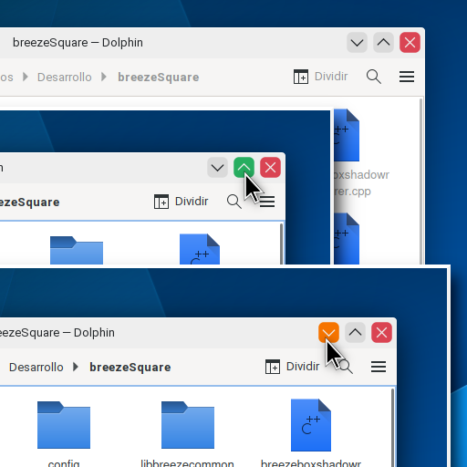

# BreezeSquare

## Overview

Fork of breeze decoration from KDE project with Square border and some Colors when the cursor is over the buttons of maximized and minimized.



## INSTALL & COMPILE

In Ubuntu is recommended to have this modules to compile:
```sh
sudo apt install build-essential libkf5config-dev libkdecorations2-dev libqt5x11extras5-dev qtdeclarative5-dev extra-cmake-modules libkf5guiaddons-dev libkf5configwidgets-dev libkf5windowsystem-dev libkf5coreaddons-dev gettext libkf5style-dev
```

Open a terminal inside the source directory and do:
```sh
mkdir build && cd build
cmake .. -DCMAKE_INSTALL_PREFIX=/usr -DCMAKE_BUILD_TYPE=Release -DKDE_INSTALL_LIBDIR=lib -DBUILD_TESTING=OFF -DKDE_INSTALL_USE_QT_SYS_PATHS=ON
make
sudo make install
```
